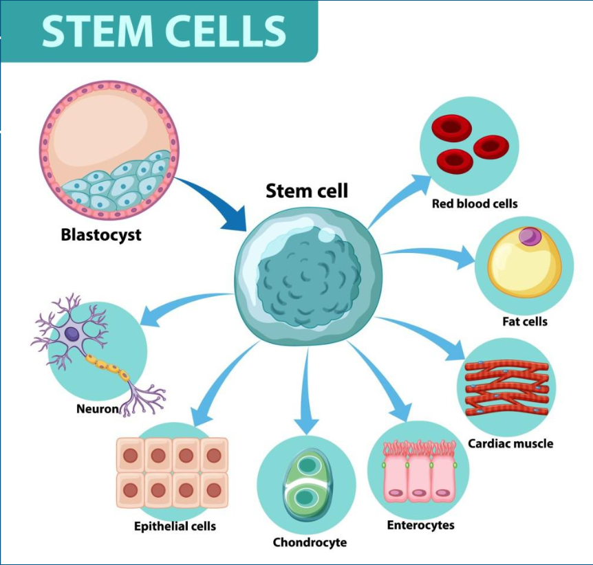
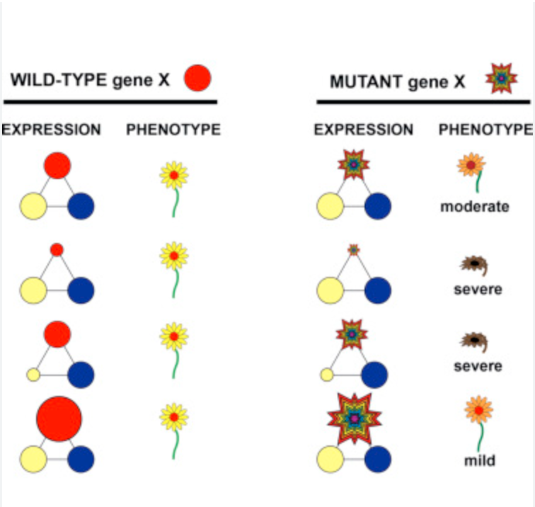
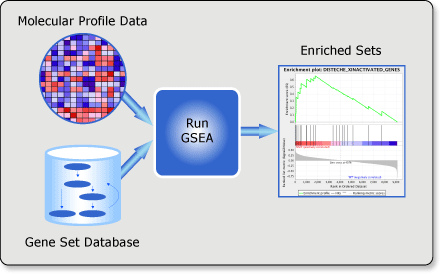
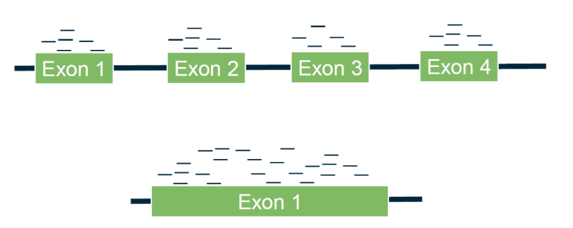

# Differential and Enrinchment Analysis with GSEA (Gene Set Enrichment Analysis)
1. [Introduction: Why?](#231) 
    1.1. [Differential Expression and Differential Analysis of Genes](#2311) 
    2.2. [Gene Set Enrichment Analysis](#2312)
2. [Differential Gene Expression Analysis: How?](#232) 
    2.1. [General Workflow](#2321) 
    2.2. [Methods and Methods comparison](#2322)
3. [Gene Set Enrichment Analysis: How?](#233)

## 1. Introduction
Have you wondered about how different kind of cells in our body are developed despite their similar DNA composition? Have you considered why some patients die from particular disease, while some do not? 
 

A foundamental concept underlying those phenomonon is the **Differential Expression of genes**. Genes are expressed differentially under different conditions to allow for different combinations of proteins and activation of certain biological pathway. Analyzing **differential expression of a set of genes** under different conditions can uncover mystery behind development of stem cells and cause of diseases [4]. 

Tools like **GSEA** can help us achieve this goal. However, before we dive deeper, let's start with some *basic concept review*. 

#### 1) Differential Expression and Differential Analysis of Genes

> **Differential Expression of genes** is *a evident change in read counts or expression level of genes under different conditions* [1]. 

Let's make a analogy here to help to understand this concept better. Let's consider different kinds of genes as different kinds of the lego building block.
 
It's intuitive that you need many white lego blocks to build a cloud lego while some white lego blocks to build the black cat for its eyes. 
  
In different biological conditions, same gene will be expressed in different amount based on needs. This phenomena is the differential expression of the gene. 

> **Differential analysis** is to *analyze significant change in gene expression level of **a gene** under different biological conditions*.
[5] 

As its name, differential analysis is computational method used to detect **evident change of gene expression of *a gene* under different conditions**, **or between two phenotype**[2]. It will require inputs like raw counts of gene expression in different condition and conduct statistical analysis (like t-test) to check if difference is statistically significant. 
 
#### 2) Gene Set Enrichment Analysis

- **Gene Set Enrichment Analysis** is to *analyze evident change in expression level of **a priori sets of gene** in different conditions* [3]. 
[3]

Going back to our lego analogy, we know that different kind of lego products is consist of different combination of lego building blocks. Knowing how many blocks we have for certain product can help us forsee the look of it to some degree. 

On a similar note, differential expression of a set of genes can correlate with certain phenotype of organism. That's why we want to use gene set enrichment analysis, which we use statistical method to check if there is **evident change in expression of *a sets of gene* under different biological conditions**. 

## 2. Differential Gene Expression Analysis: How?
From the concept review, you probably can see how differential gene expression analysis is a necessary previous step of GSEA. 

To check if a set of genes is expressed differentially, we need to determine if a gene is expressed differentially first. Because we want to focus on GSEA in this chapter, let's take some time to go through the general workflow of DGE (differential gene expression analysis). 

#### 1) General Workflow 
The procedure of DGE can be generally concluded as follow: 
- 1. Normalization 
- 2. Statistical Test
- 3. P value check (P < 0.05, change is statistically significant; otherwise, it is not)

Let's dive into details one by one. 
1. **Normalization**</a>
   
   In RNA-seq downstream analysis, we will know how many reads are mapped to particular genes (that can be roughly taken as measure of expression level sometimes). 
    
   *However, count of reads does not necessarily reflect the actual expression level of a gene.*

   To be specific, it's much easier for a gene that is *longer* and located in *DNA has higher counts of reads mapping* to have more reads mapped to it. Therefore, we need to take **gene length** and **library size** into consideration. That's why we need to first conduct normalization to make sure we get valid expression level from input counts data. Common strategy and equations used for normalziation are presented below. [BENG183 Lecture]

    

2. **Statistical Test**</a>

   We only care about **evident** change in expression level under different conditions. Thus, to make sure the difference in value in not caused by chance, we need to conduct statistical test, usually a t-test, to compare and make sure the change in expression level under different condition is significant.

    [5]

3. **P Value Check**</a>

   To check significance, we will use p value generated from t-test and 0.05 as threhold to determine its significance
   
   **If P < 0.05, change is statistically significant; otherwise, it is not significant.**

   

> Based on these general ideas, we'll walk through one of the most popular techniques for Differential Analysis and then briefly introduce other methods, as well as how to choose tools that work best for GSEA.

## 2.3.2 Overivew of 3C methods

[Figure1](https://doi.org/10.1016/j.tplants.2018.03.014). Schematic Representation of Chromosome Conformation Capture (3C) and 3C-Derived Methods. These methods help to elucidate nuclear organization by detecting physical interactions between genetic elements located throughout the genome. Abbreviations: IP, immunoprecipitation; RE, restriction enzyme. **Figure by Sotelo-Silveira, Mariana, et al. Trends in Plant Science (2018).**

To better understand the difference between these methods, I'd like to distingush them between the following couple of aspects:

#### 1) Specificity - What does _one, all, many_ mean
‘1’, ‘Many’ and ‘All’ indicate how many loci are interrogated in a given experiment. For example, ‘1 versus All’ indicates that the experiment probes the interaction profile between 1 locus and all other potential loci in the genome. ‘All versus All’ means that one can detect the interaction profiles of all loci, genome-wide, and their interactions with all other genomic loci [1].

These kind of specificity is determined by the primer when people use **specific primers** before PCR. 

#### 2) Through-put and resolution
Hi-C techniques has the highest through-put (billion reads per sample) but suffering of a relative low resolution of 0.1-1Mb. However, the other methods usually have a higher resolution  around 1kb. For more details one can refer to table2 in [2].

## 2.3.3 Hi-C
Hi-C is the highest through-put version of 3C-derived technologies. Due to the decreasing cost of 2nd generation sequencing, hi-c is widely used.

The principle of Hi-C can be illustrated as:

##### Hi-C critical steps [8] 
- Fixation: keep DNA conformed
- Digestion: enzyme frequency and penetratin
- Fill-in: biotin for junction enrichment
- Ligation: freeze interactions in sequence
- Biotin removal: junctions only
- Fragment size: small fragments sequence better
- Adapter ligation: paired-end and indexing
- PCR: create enough material for flow cell

##### Hi-C derived techniques 
- Hi-C original: [Lieberman-Aiden et al., Science 2010](doi: 10.1126/science.1181369)
- Hi-C 1.0: [Belton-JM et al., Methods 2012](doi: 10.1016/j.ymeth.2012.05.001)
- In situ Hi-C: [Rao et al., Cell 2014](doi: 10.1016/j.cell.2014.11.021)
- Single cell Hi-C: [Nagano et al., Genome Biology 2015](https://doi.org/10.1186/s13059-015-0753-7)
- DNase Hi-C [Ma, Wenxiu, Methods et al](https://www.ncbi.nlm.nih.gov/pubmed/25437436)
- Hi-C 2.0: [Belaghzal et al., Methods 2017](https://www.ncbi.nlm.nih.gov/pubmed/28435001)
- DLO-Hi-C: [Lin et al., Nature Genetics 2018](https://doi.org/10.1038/s41588-018-0111-2)
- Hi-C improving: [Golloshi et al., Methods 2018](https://www.biorxiv.org/content/biorxiv/early/2018/02/13/264515.full.pdf)
- Arima 1-day Hi-C: [Ghurye et al., BioRxiv 2018](https://www.biorxiv.org/content/early/2018/02/07/261149)

## 2.3.4 ChIA-PET 
ChIA-PET is another method that combines ChIP and pair-end sequencing to analysis the chromtin interaction. It allows for targeted binding factors such as: estrogen receptor alpha, CTCF-mediated loops, RNA polymerase II, and a combination of key architectural factors. on the one hand, it has the benefit of achieving a higher resolution compared to Hi-C, as only ligation products involving the immunoprecipitated molecule are sequenced, on the other hand, ChIA-PET has systematic biases due to ChIP process:
- Only one type of binding factor selected
- Different antibodies
- ChIP conditions

## 2.3.5 Selected methods comparison 
<table>
 <tbody>
    <tr>
        <th>Method</td>
        <th>Targets</td>
        <th>Resolution</td>
        <th>Notes</td>
    </tr>
    <tr>
        <td>3C <a href="http://refhub.elsevier.com/S2001-0370(17)30093-4/rf0535">[3]</a></td>
        <td>one-vs-one</td>
        <td>~1–10 kb </td>
        <td><ul><li>Sequence of bait locus must be known</li><li>Easy data analysis</li><li>Low throughput</li></ul></td>
    </tr>
    <tr>
    <td>4C <a href="http://refhub.elsevier.com/S2001-0370(17)30093-4/rf0545">[4]</a></td>
    <td>one-vs-all</td>
    <td>~2 kb</td>
    <td><ul><li>Sequence of bait locus must be known</li><li>Detects novel contacts</li><li>Long-range contacts</li></ul></td>
    </tr>
    <tr>
    <td>5C <a href="http://refhub.elsevier.com/S2001-0370(17)30093-4/rf0550">[5]</a></td>
    <td>many-vs-many</td>
    <td>~1 kb</td>
    <td><ul><li>High dynamic range</li><li>Complete contact map of a locus</li><li>3C with ligation-mediated amplification (LMA) of a ‘carbon copy’ library of oligos designed across restriction fragment junctions of interest
3C</li></ul></td>
    </tr>
    <tr>
    <td>Hi-C <a href="http://refhub.elsevier.com/S2001-0370(17)30093-4/rf0300">[6]</a></td>
    <td>all-vs-all</td>
    <td>0.1–1 Mb</td>
    <td><ul><li>Genome-wide nucleosome core positioning</li><li>Relative low resolution</li><li>High cost</li></ul></td>
    </tr>
    <tr>
    <td>ChIA-PET <a href="http://refhub.elsevier.com/S0168-9525(15)00063-3/sbref1405">[7]</a></td>
    <td>Interaction of whole genome mediated by protein</td>
    <td>Depends on read depth and the size of the genome region bound by the protein of interest</td>
    <td><ul><li>Lower noise with ChIP</li><li>Biased method since selected protein</li></ul></td>
    </tr>
 </tbody>
</table>

# Referrence
[1] Anjum A, Jaggi S, Varghese E, Lall S, Bhowmik A, Rai A. Identification of Differentially Expressed Genes in RNA-seq Data of Arabidopsis thaliana: A Compound Distribution Approach. J Comput Biol. 2016 Apr;23(4):239-47. doi: 10.1089/cmb.2015.0205. Epub 2016 Mar 7. PMID: 26949988; PMCID: PMC4827276.  

[2] Abbas, M., EL-Manzalawy, Y. Machine learning based refined differential gene expression analysis of pediatric sepsis. BMC Med Genomics 13, 122 (2020). https://doi.org/10.1186/s12920-020-00771-4 

[3] Gene Set Enrichment Analysis Website. https://www.gsea-msigdb.org/gsea/doc/GSEAUserGuideFrame.html 

[4] Differential Gene Expression | Definition & Analysis. https://study.com/academy/lesson/differential-gene-expression-definition-examples.html#:~:text=Differential%20gene%20expression%20defines%20the,of%20liver%20and%20skin%20cells  

[5] Comparing experimental conditions: differential expression analysis. https://biocorecrg.github.io/CRG_Bioinformatics_for_Biologists/differential_gene_expression.html. 

[6] Lieberman-Aiden E, van Berkum NL, Williams L, Imakaev M, Ragoczy T, Telling A, et al. Comprehensive mapping of long-range interactions reveals folding principles of the human genome. Science 2009;326(5950):289–93. 

[7] Fullwood, M.J. et al. (2009) An oestrogen-receptor-alpha-bound human chromatin interactome. Nature 462, 58–64. 

[8] https://github.com/hms-dbmi/hic-data-analysis-bootcamp/blob/master/HiC-Protocol.pptx.

