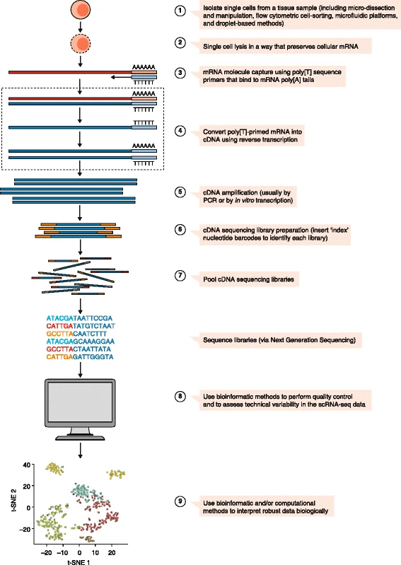
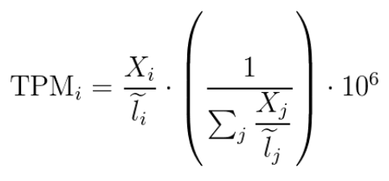
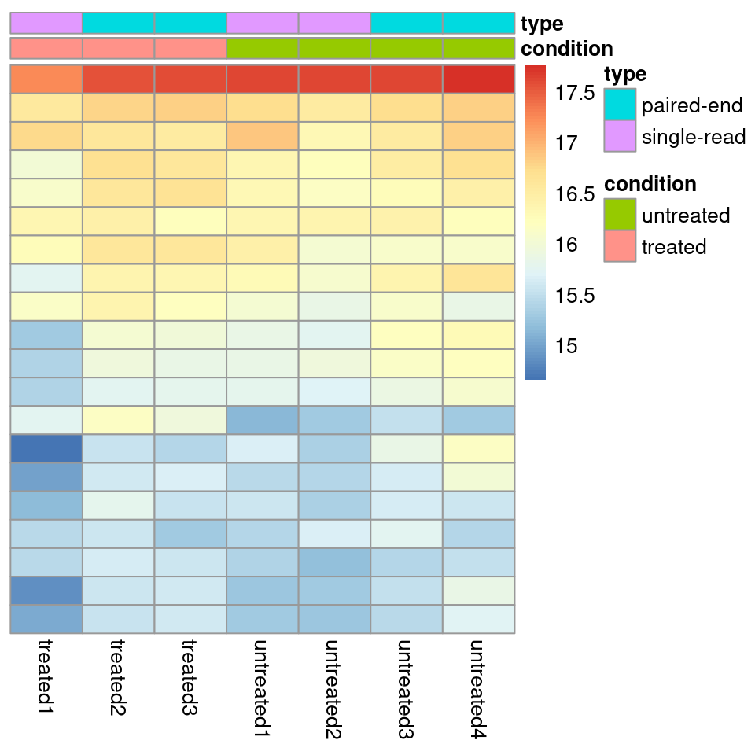

# Gene Expression Analysis with RNA-seq

Written by: Peter Lu, Aaron Sonin, Numa Yazadi

## Introduction

Understanding gene expression is crucial for unraveling the molecular mechanisms underlying various biological processes, such as development, disease, and response to environmental stimuli. One powerful tool for studying gene expression is RNA sequencing (RNA-seq), which allows for a comprehensive quantitative assessment of the transcriptome, or in other words, the complete set of RNA molecules in a cell or tissue.

## RNA-seq Overview

### Principle

RNA-seq involves the following key steps:

1. **RNA Extraction**: Total RNA is isolated from a sample of interest, which can be cells, tissues, or even single cells.

2. **Library Preparation**: The extracted RNA is converted into a library of cDNA (complementary DNA) molecules. This step typically involves the fragmentation of RNA and the addition of adapter sequences.

3. **Sequencing**: The cDNA library is sequenced using next-generation sequencing (NGS) technology, generating millions of short reads.

5. **Data Analysis**: The sequenced reads are processed to infer gene expression levels and identify differentially expressed genes.

*An overview of the RNA-Seq pipeline [[3]](https://genomemedicine.biomedcentral.com/articles/10.1186/s13073-017-0467-4#Fig1)*

### RNA-seq Pipeline

Here is a basic overview of the tools used in the pipeline for RNA-Seq differential expression analysis:

| Tool          | Input                                         | Output                                | Purpose                                          |
|---------------|-----------------------------------------------|---------------------------------------|--------------------------------------------------|
| `fastqc`        | Fastq Reads                                   | Quality Report HTML                   | Check read quality                               |
| `Trim Galore`   | Fastq Reads                                   | Trimmed fastq reads                   | Trim adapter sequences                           |
| `STAR`          | Trimmed fastq reads + Transcriptome reference | SAM / BAM aligned reads               | Align reads to reference genome or transcriptome |
| `featureCounts` | SAM/BAM + Reference                           | Count matrix                          | Quantify expression                              |
| `DESeq2`        | Count Matrices for Samples                    | Differential expression for each gene | Figure out difference between samples            |

Figure 1: Overview of the RNA-seq analysis pipeline. The process includes RNA extraction, library preparation, sequencing, and data analysis.

### File Formats

- **FASTQ**: Raw sequencing data, containing sequence reads and their associated quality scores.

- **SAM/BAM**: Sequence Alignment/Map files for mapping reads to a reference genome.

- **GTF/GFF**: Annotation files defining gene and transcript structures.

- **Counts Table**: A table that quantifies the number of reads or fragments aligned to each gene.

### Altogether...
Essentially, the bioinformatic RNA-Seq pipeline looks something like this:
- First, we use fastqc to determine the quality of our reads.
- If everything checks out, we use a tool, such as trim galore, to trim the adapter sequences (if using a technology like Illumina sequencing, for example), and check the quality again.
- Next, we use an alignment tool such as STAR along with our trimmed reads and reference transcriptome to align the reads to the reference transcriptome. This will output aligned reads.
- Next, we use a tool like featureCounts to quantify the expression of our mapped reads, to get a count matrix.
- Finally, we use a tool such as `DESeq2` to compare counts between samples, and figure out the fold change.

## Quantification of Gene Expression

To quantify gene expression, RNA-seq data is typically analyzed in terms of read counts or normalized expression values. Three commonly used metrics for expression quantification are RPKM, FPKM, and TPM.

### RPKM (Reads Per Kilobase Million)

RPKM measures gene expression as the number of reads mapping to a gene per kilobase of its coding sequence per million mapped reads. It normalizes for gene length and sequencing depth.

Figure 2: RPKM calculation formula.

### FPKM (Fragments Per Kilobase Million)

FPKM is similar to RPKM but considers fragments (paired-end reads) rather than individual reads. It is especially useful when working with paired-end sequencing data.

Figure 3: FPKM calculation formula.

### TPM (Transcripts Per Million)

TPM quantifies gene expression as the proportion of transcripts attributed to a specific gene, normalized to the total number of transcripts in the sample.

Figure 4: TPM calculation formula.

TPM is typically the preferred measure of gene expression for differential expression analysis for a handful of good reasons:

1. **Normalization for Transcriptome Size**: TPM is normalized to the total RNA reads in each sample. This means that the sum of all TPM values in a sample is the same, which makes it a lot easier to compare expression levels across different samples. In contrast, RPKM and FPKM instead normalize for sequencing depth and gene length, but not for the total number of reads, which can vary a lot between samples - making comparing them between samples difficult.
2. **Better Handling of RNA Composition Effects**: TPM is more effective in accounting for differences in RNA make-up between samples. In RPKM and FPKM, a disproportionately expressed gene can take up a huge portion of the reads sampled, which can skew the perceived expression levels of other genes. TPM, on the other hand, fixes this issue by normalizing each gene’s expression to the total transcriptome size, making it less susceptible to variations caused by a handful of highly expressed genes.
3. **Look-ability**: TPM provides an instantly intuitive understanding of the data. A TPM value of 100, for instance, means that for every million transcripts in your sample, 100 are from the gene of interest. This direct interpretation is not as straightforward with RPKM or FPKM; and this way, it is a lot more obvious just by looking at the numbers what sort of difference there may be between samples. Not that we don't still need to run statistics, though!

## RNA-Seq Differential Expression Analysis

### So, why differential expression?

In many situations, it can be useful to compare quantified gene expression using RNA-Seq between samples; for instance:
- **Identifying Disease Mechanisms**: By analyzing gene expression with respect to diseases and infections, we can figure out what pathways they use and possible treatments.
- **Drug Development and Testing**: By figuring out what genes drugs affect the expression of, we can better understand them and develop new ones.
- **Cancer Gene Identification**: By identifying genes that are expressed differently in cancer cells, we can create better treatments.
- **Gene Regulation Research**: Knowing which genes regulate others can be helpful in developing treatments and technologies that make use of the natural mechanisms of the genome.
- **More!** Given that gene expression is such a fundamental part of biology, there are plenty of use cases for differential expression analysis other than what was mentioned above.

### DESeq2 for differential expression

There are many different tools that can be used to perform differential expression analysis, but the one we'll be explaining is [**DESeq2**](https://bioconductor.org/packages/release/bioc/html/DESeq2.html) [1]. DESeq2 is an R package that can be used to compare RNA-Seq expression data between samples, and is used for its ability to process high-throughput data.

### Example output

DESeq2 gives its output in the form of a table with information about each gene that includes:
- Gene identifiers
- Base mean expression
- Log2 fold change
- p-values
- adjusted p-values
among other output.

Here's an example of what that data may look like:

| Gene ID | Base Mean | Log2FoldChange | P-Value | Adjusted P-Value |
| ------- | --------- | --------------- | ------- | -----|
| Gene1 | 1000 | 2.5 | 0.0001 | 0.001 |
| Gene2 | 500 | -1.2 | 0.05 | 0.2 |
| Gene3 | 200 | 0.8 | 0.001 | 0.01 |

This data can be used to create a heatmap, which uses colors to represent the magnitude of gene expression values, allowing you to easily identify patterns of upregulation or downregulation across different conditions or samples. Rows typically represent genes, while columns represent samples or conditions. Here's ane example of what this typically looks like:

As you can see, by using a heatmap, it becomes easy to visually tell what genes may be regulated differently between samples. However, that's not enough to make a judgement on hypothesis, of course - there are also statistics involved!

### The magic statistics behind DESeq2

The [DESeq2 Paper](https://genomebiology.biomedcentral.com/articles/10.1186/s13059-014-0550-8) [2] goes into detail about the various statistical techniques it uses to perform differential expression analysis, the most notable of which are:

#### Normalization
Before performing analysis, DESeq2 performs a specific type of normalization (size factor normalization) to account for differences in library sizes and sequencing depth across samples.

#### Negative binnomial distribution
First and foremost, DESeq2 models the distribution of expression counts as a **negative binomial distribution**. This helps account for the variability which can be sene in count data, and also helps to handle the overdispersion that is often present in RNA-Seq data. In other words, the variance in high-throughput RNA-Seq data is typically larger than we'd expect for the typically-used Poission distribution, so the negative binomial is a more accurate model via its dispersion parameter. Genes with higher expression levels tend to have higher variability between samples, and we ideally want to control for this. DESeq2 accomplishes this by using the dispersion parameter of the negative binomial distribution; this is called the **mean-variance relationship**.

#### Independent Filtering
In addition, DESeq2 applies a heuristic to filter out genes with low counts that are unlikely to be differentially expressed, which helps increase the statistical power and thus accuracy of its output.

Modeling the relationship is necessary because genes with higher expression levels tend to have higher variability between replicates. Ignoring this mean-variance relationship could lead to incorrect statistical tests. By explicitly including the dispersion parameter αi, DESeq2 is able to properly account for heteroscedasticity in the count data based on expression level.

#### Empirical Bayes Shrinking
Additionally, DESeq2 uses a technique called **empirical bayes shrinking** to estimate dispersion and fold changes. It treats each gene separately and estimates dispersion per-gene, and then fits these dispersions on a smooth curve. These estimates are then "shrinked" along the curve towards the values predicted by the curve, which gives us the final dispersion values.

A simpler way of explaining empirical bayes shrinking is that we're accounting for a smaller sample size by using a larger set of "prior knowledge", which makes our final result more accurate. In the case of DESeq2, we're estimating the dispersion for each gene individually, and then using a model of the dispersion based off of the *entire* sample as our "prior knowledge" to more accurately "shrink" the individual dispersions towards more accurately estimated values.

#### Wald Test
DESeq2 uses a statistical test called the **Wald test** to calculate the P-values and make the final call as to whether a gene is statistically likely to be differentially expressed between two samples. The Wald test calculates a "coefficient of interest" from the data, and then divides this by the standard error. This is then tested on an approximately normal distribution to calculate the P-value.

#### P-value adjustment
DESeq2 can help lower the false discovery rate (FDR) by using the Benjamini-Hochberg procedure. This involves first sorting all of the p-values in ascending order. Then, each p-value is compared with its Benjamini-Hochberg critical vlaue, which is the rank of the value in the sorted list divided by the number of p-values, times a user-defined acceptable false positive rate. Then, all p-values less than the critical value are discarded.

#### So...
Pretty neat, huh? All of this statistical magic thrown together makes DESeq2 one of the most popular tools for performing differential expression analysis. However, it's not the only tool on the block - we'll also take a brief look at another tool for differential expression analysis, called `cuffdiff`.

### Other tools for differential expression
There are a few other tools that are useful for differential expression analysis - these include the likes of edgeR, baySeq, NOISeq, SAMSeq, limma, EBSeq, and Cuffdiff. Many of these tools use different distributions and statistical models to perform their analyses, and are thus useful for different purposes. For example, NOISeq and SAMseq use a non-parametric model, while edgeR, DESeq, and baySEQ use a negative binomial distribution [[5]](https://doi.org/10.1093/bib/bbt086).

Specifically, we're going to take a quick look at Cuffdiff and how it's different from DESeq2. Cuffdiff is part of the popular Cufflinks package [[4]](https://doi.org/10.1038/nprot.2012.016).

While both can be used to perform differential expression analysis, they do have different methodologies, which makes them suitable for different types of experiments. DESeq2 primarily conducts gene-level analysis, while Cuffdiff specializes in transcript-level analysis [[5]](https://doi.org/10.1093/bib/bbt086). The capability of Cuffdiff to perform transcript-level analysis is attributed to its integration with the Cufflinks package, which first aligns the reads into transcripts, facilitating detailed investigation at the transcript level. The key difference between gene-level and transcript-level analysis lies in the level of granularity. Gene-level analysis provides an overview of the entire gene's expression, while transcript-level analysis splits gene expression into all types of transcript isoforms.

For example, to perform alternative splicing analysis, Cuffdiff would be the appropriate tool to use since each RNA isoform corresponds to a unique combination of exons, and you want to know if specific isoforms are upregulated or downregulated [[6]](https://zhonglab.gitbook.io/3dgenome/chap0-preparation/03-rna-seq-differential-analysis). On the other hand, DESeq2 wouldn't be the appropriate tool here since all the RNA isoforms would be considered as the same gene, hiding the information on the specific isoform expressions.

Additionally, unlike DESeq2, cuffdiff is written in C++ which can help afford it extra computation speed since it compiles down to native code.

## Works Cited
1. **DESeq2 - Bioconductor** https://bioconductor.org/packages/release/bioc/html/DESeq2.html
2. Love, M.I., Huber, W. & Anders, S. **Moderated estimation of fold change and dispersion for RNA-seq data with DESeq2**. Genome Biol 15, 550 (2014). https://doi.org/10.1186/s13059-014-0550-8
3. Haque, A., Engel, J., Teichmann, S.A. et al. **A practical guide to single-cell RNA-sequencing for biomedical research and clinical applications**. Genome Med 9, 75 (2017). https://doi.org/10.1186/s13073-017-0467-4
4. Trapnell, C., Roberts, A., Goff, L., Pertea, G., Kim, D., Kelley, D. R., Pimentel, H., Salzberg, S. L., Rinn, J. L., & Pachter, L. (2012). **Differential gene and transcript expression analysis of RNA-seq experiments with TopHat and Cufflinks**. Nature protocols, 7(3), 562–578. https://doi.org/10.1038/nprot.2012.016
5. Seyednasrollah, F., Laiho, A., & Elo, L. L. (2015). **Comparison of software packages for detecting differential expression in RNA-seq studies**. Briefings in bioinformatics, 16(1), 59–70. https://doi.org/10.1093/bib/bbt086
6. Wen, X., Zhong S. **3D Genome**. https://zhonglab.gitbook.io/3dgenome/chap0-preparation/03-rna-seq-differential-analysis
7. Love M., Anders S., Huber W. (2023). **Analyzing RNA-seq data with DESeq2**. Bioconductor. https://bioconductor.org/packages/devel/bioc/vignettes/DESeq2/inst/doc/DESeq2.html
8. Slides from class
