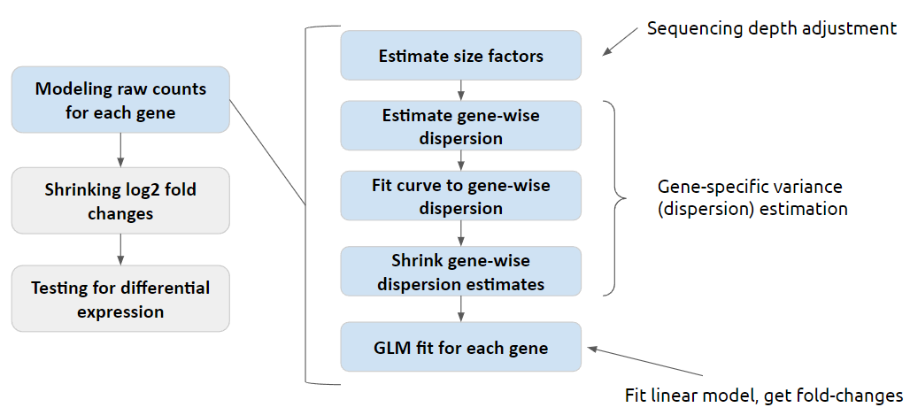
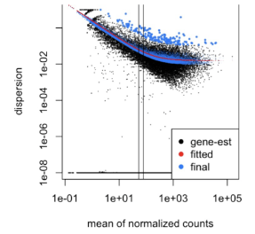
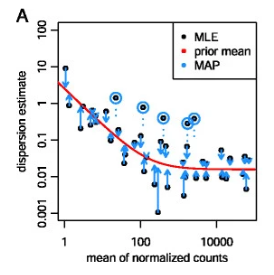

# Under the hood of DESeq2
#### Team 24: Minyoung Ahn, Joelle Faybishenko, Monica Park
## Contents
- [Introduction](#introduction)
- [Addressing problems specific to RNA-seq data](#addressing-problems-specific-to-rna-seq-data)
- [DESeq2 pipeline overview](#deseq2-pipeline-overview)
- [Sample-specific size factor estimation](#sample-specific-size-factor-estimation)
- [Gene-specific dispersion estimation](#gene-specific-dispersion-estimation)
- Obtaining fold changes
- Testing for differential expression
- [References](#references)
## Introduction
The ability to obtain the entire transcriptome of a biological sample through high-throughput RNA-sequencing has created a need for tools that enable analysis of this data. One of the most powerful and widely used tools for this purpose is DESeq2 which applies a variety of statistical tools to identify genes that are differentially expressed between two or more experimental conditions, such as treatment versus control groups. 

Briefly, the steps of differential expression analysis of RNA-seq data are as follows:
1. Reads from an RNA-seq experiment are mapped to the host genome using STAR or an analogous alignment tool.
2. Using the alignments from the previous step expression levels for each gene are quantified, for instance using featureCounts or htseq-count. 
4. Normalization across samples and differential expression analysis is done using DESeq2.
5. With the set of differentially expressed genes, many types of downstream analysis can be performed such as heatmaps generation or functional enrichment analysis on the gene set. 

In this paper, we will explore the statistical pipeline that DESeq2 uses to identify differentially expressed genes. 
## Addressing problems specific to RNA-seq data
## DESeq2 pipeline overview

In order to identify differentially expressed genes, DESeq2 fits a negative binomial generalized linear model (a GLM with logarithmic link function) to each gene. A negative binomial distribution is applied as opposed to a poisson distribution in order to capture the tendency of RNA-seq data to be overdispersed, meaning that the variance of gene expression exhibits a disproportionate increase for a given increase in the expression level mean. 

Mathematically, for a gene $i$ and sample $j$, DESeq2 models read counts $K_{ij}$ using
$$K_{ij} \sim NB(\text{mean} = \mu_{ij}, \text{dispersion}=\alpha_i)$$
where $NB$ represents the negative binomial distribution.

Broadly, this is accomplished by 
1. normalizing the raw count data by estimating sample-specific size factors $s$,
2. estimating gene-specific dispersion factors $\alpha$,
3. fitting the generalized linear model and obtaining fold changes,
4. shrinking fold-changes,
5. and statistically testing for differential expression, i.e. significant fold changes.
## Sample-specific size factor estimation
Because DESeq2 takes in raw expression data, the data must first be normalized to account for sample-dependent sequencing depth. DESeq2 does this by modelling the mean gene expression $\mu_{ij}$ for gene $i$ of sample $j$ as $$\mu_{ij} = s_j \times q_{ij}$$ where $s_j$ is the size factor for sample $j$ and $q_{ij}$ is the raw gene expression value for gene $i$ of sample $j$. 

Visualizing the data in the form of a count matrix indexed by genes with each column representing a different sample, DESeq2 performs the following steps to estimate $s$:
1. Find the pseudo-reference for each gene, defined as the row-wise geometric mean
2. Compute the raw-value to pseudo-reference ratio for each column
3. Define $s_{j}$ as the median ratio of each column
4. Normalize counts by dividing by the corresponding $s_j$
## Gene-specific dispersion estimation
After normalizing for sequencing depth, DESeq2 proceeds to model the variance of the expression distribution for each gene $i$. It does this by estimating the dispersion factor for each gene $\alpha_i$ which is related to its variance of expression level $K$ by $$Var(K_{ij})=\mu_{ij} + \alpha_i\mu_{ij}^2$$ where $\mu_{ij}$ represents the mean gene expression for gene $i$ of sample $j$. 

DESeq2 first estimates each gene's dispersion using maximum-likelihood estimation (MLE) based on the empirical replicates of each gene individually. After obtaining the initial dispersion estimate for every gene, it then plots these estimates (shown as black points in the figure above) on a dispersion-versus-mean plot. 

Because there is a tendency for this method to overestimate dispersion, DESeq2 applies a round of empirical bayes shrinkage. To do this, DESeq2 obtains the curve of best fit (shown in red) across every gene's estimate. This function is then used as the prior for the empirical bayes shrinkage, where each gene's dispersion is regressed towards the curve with the magnitude of regression depending on the initial estimate's distance from the curve and the sample size of the original estimation. This is done on the assumption that genes with similar mean expressions should have similar dispersions. Since there may be cases where a gene's dispersion is much higher than the prior due to underlying biological reasons, DESeq2 only uses the shrunken estimation of a gene's dispersion if its original estimate is within two residual two standard deviations from the curve. In either case, the resulting dispersion, also referred to as the maximum a-posteriori (MAP) estimate, is used as the dispersion parameter of a given gene's negative binomial distribution. 
## Obtaining fold changes
## Testing for differential expression
## References
