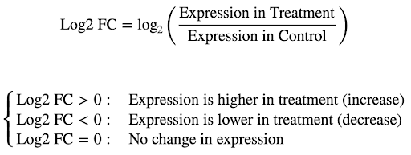
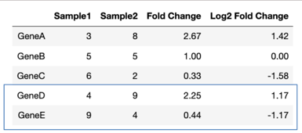
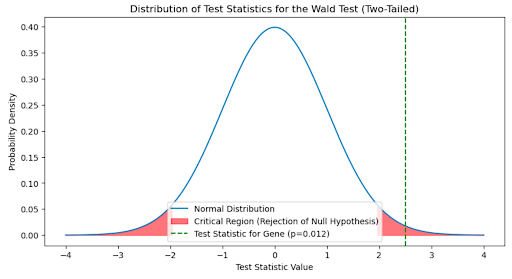
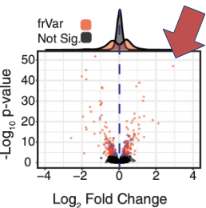
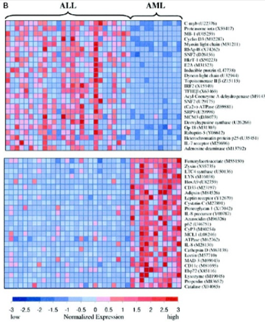

# Quickstart Guide to DESeq2

BENG 183 Final Project   
Group #25

By:
Neo Torres
Audria Montalvo
John Chen

- **1:** [RNAseq Overview](#)
- **2:** [Differential Expression Overview](#)
- **3:** [DEseq2 Input](#)
- **4:** [DEseq2 Description](#)
- **5:** [DEseq2 Output](#deseq2-output)
	- **5.1**: [log2foldchange](#deseq2-output-log2foldchange)
	- **5.2**: [Statistical Significance](#deseq2-and-statistical-significance)
- **6:** [Differential Expression Visualization](#)
- **7:** [Using Differential Expression Tools](#)


### ......previous parts......

## DEseq2 Output


- **Count Matrix to Normalized Count Matrix**:
	- The initial count matrix consists of raw counts of gene expression levels.
	- DESeq2 transforms this into a normalized count matrix, accounting for sequencing depth and RNA composition
	  effects.

- **Log2 Fold Change Calculation**:
	- The normalized counts are used to calculate the log2 fold change.
	- This represents the difference in expression between two conditions, indicating upregulation or downregulation.

- **P-value Computation**:
	- The p-value measures the probability that the observed difference in expression is due to chance.
	- It is calculated for each gene to assess the significance of its expression change between conditions.

- **Adjustment for Multiple Hypothesis Testing**:
	- The Benjamini-Hochberg procedure adjusts the p-values to control the false discovery rate.
	- This adjustment is crucial when testing multiple hypotheses simultaneously.

- **Adjusted P-value (padj)**:
	- The adjusted p-value, or padj, reflects the chance of observing the difference in expression by random chance
	  after correction for multiple testing.
	- A gene is considered differentially expressed if the padj is below a certain threshold, usually 0.05.

### DESeq2 Output: log2foldchange

One of the key metrics it provides is the log2 fold change, which indicates the extent of differential expression
between two conditions.

**Log2 Fold Change Explained**



- **Formula**: `Log2 Fold Change (FC) = log2 (Expression in Treatment / Expression in Control)`
- **Interpretation**:
	- **Log2 FC > 0**: Gene expression is higher in the treatment group compared to the control group.
	- **Log2 FC < 0**: Gene expression is lower in the treatment group compared to the control group.
	- **Log2 FC = 0**: There is no significant change in gene expression between the treatment and control groups.

**Advantages of Log2 Fold Change**

- **Symmetric Scaling**: Provides an equal view of up and down regulation, allowing for easier comparison between genes.
- **Wide Ranges**: Capable of handling wide ranges of expression values, making it suitable for genes with low and high
  expression.
- **Data Normalization**: Reduces skewness of the data, which can improve the interpretability of the results.

**Sample Data Interpretation**


The table provided in the slide shows gene expression counts for five different genes (GeneA to GeneE) across two
samples, along with the calculated fold change and log2 fold change.

- **Example**: GeneA shows an increase in expression in the treatment group with a log2 fold change of 1.42, indicating
  that it is significantly up-regulated.
- **Example**: GeneD and E shows the strength of the log2 fold change in interpretability, with GeneD showing a
  relatively small change in expression (0.44) and GeneE showing a large change in expression (2.25) in normal Fold
  change. However, when converted to log2 fold change, the difference in expression between GeneD and E is more
  apparent (1.17 vs -1.17).

## DESeq2 and Statistical Significance

Understanding the p-value is essential when analyzing RNA-Seq data with DESeq2. The p-value helps determine whether the
observed differences in gene expression are statistically significant or not.

**Key Concepts of P-value in DESeq2**




- **Confidence in Log2 Fold Change**: The p-value provides a measure of confidence in the log2 fold change calculated
  for gene expression.

- **Hypothesis Testing with the Wald Test**:
	- **Null Hypothesis**: The default assumption that there is no difference in gene expression between the
	  conditions (log2 fold change is 0).
	- **Test Statistic**: A value derived from the Wald test, representing the difference between the observed data and
	  the null hypothesis.

- **Interpreting the Test Statistic**:
	- The example graph shows the distribution of the test statistic values.
	- The green line indicates the test statistic for a particular gene with a p-value of 0.012, falling within the
	  red critical region for significance.

**Determining Statistical Significance**

- **Significance Threshold**: A common threshold for declaring significance is a p-value less than 0.05.
- **Implication**: If the p-value is below the threshold, it suggests that the observed log2 fold change is unlikely to
  have occurred by random chance alone, indicating differential expression.

**P-value in Research Context**

- A statistically significant p-value indicates that further investigation into the gene's role and expression under
  different conditions may be warranted.
- It is important to combine the p-value with other statistical measures and biological relevance for a comprehensive
  analysis.

## Transform pVal to pAdj
Once the pValue is calculate, an optional step is to transform it into p adjust with a process known as normalization. This is because we would like to adjust how many significant genes we will have in out output. Too many significant genes would result in too much information, making the conclusion difficult to create. Too little significant genes and there would be not much information to analyze for the conclusion.

There are two main ways this can work.
### Bonferroni Correction
The Bonferroni Correction affects the threshold by dividing the p value by the number of tests conducted. It is said to be strict which means that the threshold will be quite low.

$$pAdj = \frac{pValue}{n (number of tests)}
### False Discovery Rate
False Discovery Rate lets the user choose which percent of significant would be false positives. 

$$FDR = \frac{mP}{\text{number of genes with p < P}}$$

$$FDR = \frac{\text{number of false positives}}{\text{number of hits}}$$

After we get the p-ajust, we can visualize the data.
## Data Visualization
There are many types of data visualizations for DESeq2 and differential expression tools.
### Volcano Plots
We can plot the log2 fold change and the log2 p value. The y axis determines the significance of a particular gene. The x axis determines if the gene was upregulated or downregulated. The most significant genes are the data points that are to the top left and top right. 



### IGV
We can map the reads to the IGV tool to visualize the read alignments. This is for quality control to make sure that all the reads used in differential expression tools are valid. If the reads for each of the samples do not line up, that means there is an issue in one of the previous steps.


### Heatmaps
We can visualize the gene expression per gene per sample. For the columns, we have each sample. They are usually grouped with similar samples. For the rows, we have the genes expressions we are studying. Blue means downregulation, red is upregulation, and the intensity of the color determines how regulated the gene is. We can visually if the groups of samples does have a difference in gene expression.




## Other Differential Expression Tools
TODO: Insert graph of the tool usage

### Now it's Your Turn!
We can use DESeq2 or other differential expression tools in Jupyter Notebooks.

Below is the following to use DESeq2
0. Install Anaconda to use Jupyter Notebooks
1. Download [DESeq2 from Bioconductor](https://bioconductor.org/packages/release/bioc/html/DESeq2.html) in the Anaconda Terminal using the following command: 
```
if (!require("BiocManager", quietly = TRUE))
    install.packages("BiocManager")

BiocManager::install("DESeq2")
```
3. In a notebook cell, use `%%R` to write R code like below...
```


```

**Additional Resources**

- For detailed methodology and examples of DESeq2 p-value calculations,
  visit [hbctraining.github.io](https://hbctraining.github.io/DGE_workshop_salmon/lessons/05_DGE_DESeq2_analysis2.html).

