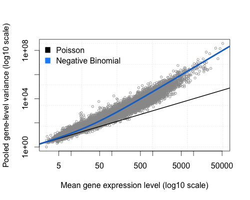
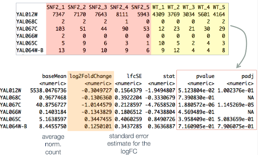
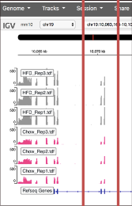
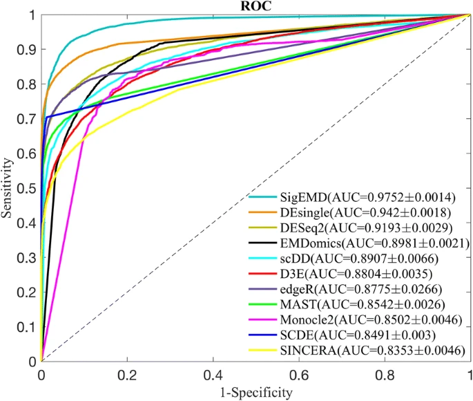

# Quickstart Guide to DESeq2

BENG 183 Final Project   
Group #25

By:
Neo Torres
Audria Montalvo
John Chen

- **1:** [RNAseq Overview](#rnaseq-overview)
- **2:** [Differential Expression Overview](#differential-expression-overview)
- **3:** [DEseq2 Input](#deseq2-input)
- **4:** [DEseq2 Description](#deseq2-description)
- **5:** [DEseq2 Output](#deseq2-output)
	- **5.1**: [log2foldchange](#deseq2-output-log2foldchange)
	- **5.2**: [Statistical Significance](#deseq2-and-statistical-significance)
- **6:** [Data Visualization](#data-visualization)
	- **6.1**: [Volcano Plots](#volcano-plots)
	- **6.2**: [IGV](#igv)
	- **6.3**: [Heatmaps](#heatmaps)
- **7:** [Using Differential Expression Tools](#other-differential-expression-tools-and-usage)
	- **7.1**: [DESeq2 - Now it's Your Turn!](#now-its-your-turn)
	- **7.2**: [Other Tools](#other-differential-expression-tools-and-usage)

<br> <br> <br>


## RNAseq Overview
RNA Transcripts controls ⭐Gene Expression⭐ which can help us find which genes are transcribed and by how much! If we want to examine both the quantity and sequences of RNA in a sample we can use next-generation sequencing (NGS). 

***What's the point of Sequencing tho?***
Great quesstion, Im glad you asked. :)
RNA Sequencing can help us anazlyze :

✅Differential Gene Expression (which is the whole topic of this paper hehehe) <br>
✅Alternative Splicing<br>
✅RNA editing<br>
✅and so much more<br>

 Here we have a visual of th pipeline aka tha overall procedure that helps us get from the raw data to eventually Differential Expression<br>

<br> <br> <br> <br> <br> <br> <br> <br> <br> <br> <br> <br> 

 
## Differential Expression Overview
We will be referring to Differential Expression as DE. As the name mentions DE is what helps us idnetify the differences in Gene Expression. We are able to identify locations where variations between groups are greater than within groups.By groups we mean samples such as wildtype and mutant samples

>Note: Variance refers to variation in gene 


## DESeq2 Description
Now about DESeq2 👀 You might be able to tell that the name itself includes **DE** and the **"Seq"** next to it.Yup, DESeq2 is a Differential Expression Sequencing tool. It is available for the public to use, all you need is to download the R/Bioconducto package. The spicy thing about why there is a "2" in the name is because.... lol it just means this is the ⭐new improved DESeq tool⭐. This one in particular "advances with several novel features to facilitate a more quantitative analysis of comparative RNA-seq data using shrinkage estimators for dispersion and fold change." [Love et al. 2014] We will explain all those fancy words like "dispersion" and "fold change" later in this paper, no worries friend!


<br> <br>


## DEseq2 Input
Here is where TPM and Replicates come in. They are simply expression units which  helps us measure the amount of transcripts and the proportion of genes. 
**TPM** in particular stand for ~Transcript per million. It "proposed as an alternative to RPKM due to inaccuracy in RPKM measurement" (Wagner et al., 2012)

**Replicates**: multiple samples that are taken from different individual within experimental condition. The cool thing about replicates is that the more replicates means the bigger the sample size we work with. Thus improving precision of expression & fold change estimates. 


## DESeq2 Method: Negative Binomial Distribution
DESeq2 uses the negative binomial distribution for estimating the distribution of the gene-level variance vs the mean gene expression level. As seen the the graph below, the black line is the poisson distribution while the blue is the negative binomial distribution. 

The gist of this is that the negative binomial distribution fits the data more in these particular graphs than poisson distributions due to overdispersion. Think of this like we are looking for the method of line of best fit. The blue line fits much better as the variance distance between the data and the line is minimal on the blue line versus the black line.



The importance of this is that poisson distributions are usually for discrete events where the probability of having an event is low. This is similar to our case where the number of reads are very high and there is a low probability that the counts of the mapped reads are high. A parameter with negative binomials allows to compensate the over-dispersion seen in poisson, which is the reason why negative binomial distributions are used in DESeq2 and other differential expression tools rather than poisson distributions [10]. 

Negative binomial takes in two functions: mean and dispersion.
The expression is $$K_{jk} ~ NB(mean = \mu_{ij}, dispersion = \alpha_{i})$$

- Mean is calculated by simply multiplying the library size by the gene length. $\mu_{ij} = s_{j}q_{ij}$

- Dispersion calculates the variance of the counts. With the process called Bayesian shrinkage, the tool combines the gene-wise dispersion estimate and the estimate of expected dispersion rate using data from all the genes.
  

## DEseq2 Output



- **Count Matrix to Normalized Count Matrix**:
	- The initial count matrix consists of raw counts of gene expression levels.
	- DESeq2 transforms this into a normalized count matrix, accounting for sequencing depth and RNA composition
	  effects.

- **Log2 Fold Change Calculation**:
	- The normalized counts are used to calculate the log2 fold change.
	- This represents the difference in expression between two conditions, indicating upregulation or downregulation.

- **P-value Computation**:
	- The p-value measures the probability that the observed difference in expression is due to chance.
	- It is calculated for each gene to assess the significance of its expression change between conditions.

- **Adjustment for Multiple Hypothesis Testing**:
	- The Benjamini-Hochberg procedure adjusts the p-values to control the false discovery rate.
	- This adjustment is crucial when testing multiple hypotheses simultaneously.

- **Adjusted P-value (padj)**:
	- The adjusted p-value, or padj, reflects the chance of observing the difference in expression by random chance
	  after correction for multiple testing.
	- A gene is considered differentially expressed if the padj is below a certain threshold, usually 0.05.

### DESeq2 Output: log2foldchange

One of the key metrics it provides is the log2 fold change, which indicates the extent of differential expression
between two conditions.

**Log2 Fold Change Explained**


- **Formula**: `Log2 Fold Change (FC) = log2 (Expression in Treatment / Expression in Control)`
- **Interpretation**:
	- **Log2 FC > 0**: Gene expression is higher in the treatment group compared to the control group.
	- **Log2 FC < 0**: Gene expression is lower in the treatment group compared to the control group.
	- **Log2 FC = 0**: There is no significant change in gene expression between the treatment and control groups.

**Advantages of Log2 Fold Change**

- **Symmetric Scaling**: Provides an equal view of up and down regulation, allowing for easier comparison between genes.
- **Wide Ranges**: Capable of handling wide ranges of expression values, making it suitable for genes with low and high
  expression.
- **Data Normalization**: Reduces skewness of the data, which can improve the interpretability of the results.

**Sample Data Interpretation**


The table provided in the slide shows gene expression counts for five different genes (GeneA to GeneE) across two
samples, along with the calculated fold change and log2 fold change.

- **Example**: GeneA shows an increase in expression in the treatment group with a log2 fold change of 1.42, indicating
  that it is significantly up-regulated.
- **Example**: GeneD and E shows the strength of the log2 fold change in interpretability, with GeneD showing a
  relatively small change in expression (0.44) and GeneE showing a large change in expression (2.25) in normal Fold
  change. However, when converted to log2 fold change, the difference in expression between GeneD and E is more
  apparent (1.17 vs -1.17).

## DESeq2 and Statistical Significance

Understanding the p-value is essential when analyzing RNA-Seq data with DESeq2. The p-value helps determine whether the
observed differences in gene expression are statistically significant or not.

**Key Concepts of P-value in DESeq2**


- **Confidence in Log2 Fold Change**: The p-value provides a measure of confidence in the log2 fold change calculated
  for gene expression.

- **Hypothesis Testing with the Wald Test**:
	- **Null Hypothesis**: The default assumption that there is no difference in gene expression between the
	  conditions (log2 fold change is 0).
	- **Test Statistic**: A value derived from the Wald test, representing the difference between the observed data and
	  the null hypothesis. [4]

- **Interpreting the Test Statistic**:
	- The example graph shows the distribution of the test statistic values.
	- The green line indicates the test statistic for a particular gene with a p-value of 0.012, falling within the
	  red critical region for significance.

**Determining Statistical Significance**

- **Significance Threshold**: A common threshold for declaring significance is a p-value less than 0.05.
- **Implication**: If the p-value is below the threshold, it suggests that the observed log2 fold change is unlikely to
  have occurred by random chance alone, indicating differential expression.

**P-value in Research Context**

- A statistically significant p-value indicates that further investigation into the gene's role and expression under
  different conditions may be warranted.
- It is important to combine the p-value with other statistical measures and biological relevance for a comprehensive
  analysis.

## Transform pVal to pAdj
Once the pValue is calculated, an optional step is to transform it into a value called p-adjust (pAdj) with a process known as normalization. This is because we would like to adjust how many significant genes we will have in the output. Too many significant genes would result in too much information, making the conclusion difficult to create. Too little significant genes and there would be not much information to analyze for the conclusion.

There are two main ways this can work: Bonferroni Correction and False Discovery Rate.

### Bonferroni Correction 
The Bonferroni Correction affects the threshold by dividing the p value by the number of tests conducted. It is said to be strict which means that the threshold will be quite low [2].

$$ pAdj = \frac{pValue}{n \text{(number of tests)}} $$


### False Discovery Rate
False Discovery Rate lets the user choose which percent of significant would be false positives, so that we can narrow down which genes would be the most differentially expressed [2].

$$FDR = \frac{mP}{\text{number of genes with p < P}}$$

$$FDR = \frac{\text{number of false positives}}{\text{number of hits}}$$

To convert this into a usable p-adjust (q-values), we can use the following code [2]:

```R
## In R
qvalues = p.adjust(pvalues, method=“fdr”)
```

```python
Import statsmodels.stats.multitest as smm
Rej, qvalues = smm.multipletests(pvalues, method=“fdr_bh”
```

After we get the p-adjust, we can visualize the data.


## Data Visualization
There are many types of data visualizations for DESeq2 and differential expression tools.

### Volcano Plots
We can plot the log2 fold change and the log2 p value. The y axis determines the significance of a particular gene. The x axis determines if the gene was up-regulated or down-regulated. The most significant genes are the data points that are to the top left and top right [9][3]. 


### IGV
We can map the reads to the IGV tool to visualize the read alignments. This is for quality control to make sure that all the reads used in differential expression tools are valid. If the reads for each of the samples do not line up, that means there is an issue in one of the previous steps[2].



### Heatmaps
We can visualize the gene expression per gene per sample. For the columns, we have each sample. They are usually grouped with similar samples. For the rows, we have the genes expressions we are studying. Blue means down-regulation, red is up-regulation, and the intensity of the color determines how regulated the gene is. We can visually if the groups of samples do have a difference in gene expression. In this case, it does[1]!


## Other Differential Expression Tools and Usage

[5] Below are the ROC curves of the programs. Essentially, the more the curve hugs the left and top side, the more accurate the model is. If a curve has such optimal shape, that maximizes the area under the curve which means the True Positive Rate is maximal for the largest area using False Positive Rate values. A line that goes diagonally describes a function that would give the answer half of the time.



We can see that DESeq2 (olive colored line) has one of the highest accuracies among the tools and compared to edgeR (purple colored line) which is at the bottom of the list. 

Tool | DESeq2 | edgeR | EBseq | cuffdiff | Kallisto
--- | --- | --- | --- |--- |--- 
Usage | R | R | R | Command Line | Command Line

We see that most tools use R or the command line. In the next section, we will demonstrate how to use one of these tools, DESeq2, in a Jupyter Notebook.

### Now it's Your Turn!
Did you know we can use DESeq2 or differential expression tools in Jupyter Notebooks with R or CLI?
With cell magics, we can use R code with `%%R` or CLI tools with `%%bash` inside a Jupyter Notebooks cells installed with Anaconda.

Below is the following to use DESeq2 which uses R [2]:
0. Install Anaconda to use Jupyter Notebooks
1. Download [DESeq2 from Bioconductor](https://bioconductor.org/packages/release/bioc/html/DESeq2.html) in the R terminal or `%%R` cell in Jupyter Notebooks using the following command: 

```R
%%R
if (!require("BiocManager", quietly = TRUE))
    install.packages("BiocManager")

BiocManager::install("DESeq2")
```

2. In a notebook cell, use `%%R` to write R code like below...

```R
%%R

## Library Loading
library("DESeq2")
library("tximport")

## Read the files from Expression Quantification output
## Use txinport to convert EQ output to what DESeq2 can read
## Filter out low counts and N/A's
## Perform DESeq2
dds <- DESeq(ddsTxi)
res <- results(dds)

## Write the results into a .csv

## Now you're done!
```

**Additional Resources**

Information from previous lectures
- [1] Dr. Sheng Zhong - BENG 183
- [2] Dr. Melissa Gymrek - CSE 185
- [3] Prof. Steven Briggs - BIMM 172

- [4] For detailed methodology and examples of DESeq2 p-value calculations,
  visit [hbctraining.github.io](https://hbctraining.github.io/DGE_workshop_salmon/lessons/05_DGE_DESeq2_analysis2.html).

- [5] https://bmcbioinformatics.biomedcentral.com/articles/10.1186/s12859-019-2599-6
- [6] https://genomebiology.biomedcentral.com/articles/10.1186/s13059-014-0550-8
- [7] https://www.bioconductor.org/packages/release/bioc/manuals/DESeq2/man/DESeq2.pdf
- [8] https://chipster.csc.fi/manual/deseq2.html 
- [9] https://pubmed.ncbi.nlm.nih.gov/35981026/
- [10] https://bioramble.wordpress.com/2016/01/30/why-sequencing-data-is-modeled-as-negative-binomial/

- https://bmcbioinformatics.biomedcentral.com/articles/10.1186/s12859-019-2599-6
- https://rdrr.io/bioc/DESeq2/man/lfcShrink.html
- https://genomebiology.biomedcentral.com/articles/10.1186/s13059-014-0550-8#citeas
- 
